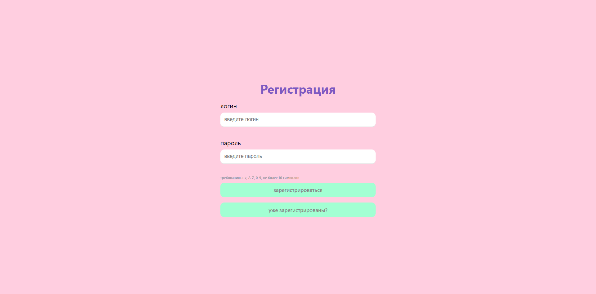
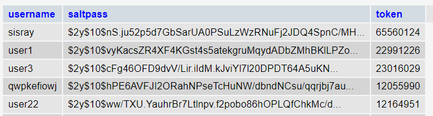
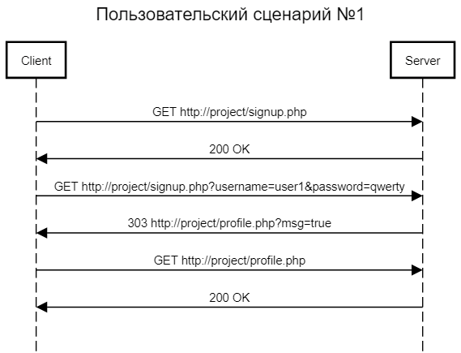
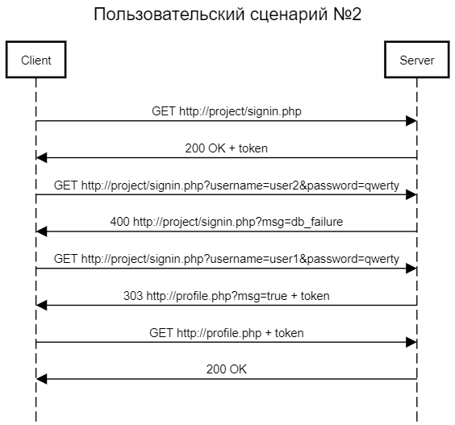
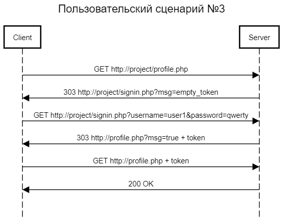

## Пользовательский интерфейс (Figma)
Необходимо создать три страницы: входа, регистрации и главную страницу сайта.
1. Страница регистрации
   
2. Страница авторизации
   
3. "Профиль"
   
   
## Пользовательские сценарии работы
1. Пользователь вводит в адресной строке signup.php, и сервер возвращает страницу регистрации. Вводит данные, пользователь с таким именем еще не зарегистрирован - сервер отправляет страницу профиля с сообщением "регистрация прошла успешно".
2. Пользователь вводит в адресной строке signin.php, и сервер возвращает страницу авторизации. Вводит логин, которого нет в БД - появляется сообщение "такого пользователя нет в БД". Пользователь вводит корректные данные и успешно попадает на сайт.
3. Пользователь вводит в адресной строке profile.php и оказывается перенаправлен на страницу со входом из-за отсутствия токена. Вводит свои верные данные и попадает на сайт.

## Описание API сервера и хореографии
Сервер использует HTTP POST запросы с полями username и password.

## Описание структуры базы данных
Для администрирования сервера MySQL и просмотра содержимого базы данных используется браузерное приложение phpMyAdmin. Используется 5 столбцов:
1. "username" типа varchar_32, хранящее логины пользователей.
2. "saltpass" типа varchar_100, хранящее пароли пользователей в хэшированном виде.
3. "token" типа varchar_100, хранящее присвоенные пользователям куки.

Пример того, как данные пользователей выглядят в базе данных.
   

## Описание алгоритмов
1. Алгоритм регистрации на сайте - принимаются все введённые пользователем данные и хэшируется пароль. Если пользователь оставил одно из полей логин/пароль пустым, появляется сообщение "Заполните это поле.". Далее отправляется запрос, который проверяет, нет ли уже пользователя с таким именем в базе данных. При условии, что пользователь с подобным логином не был найден в базе данных, серверу отправляется запрос и пользователь заносится в базу данных, после чего попадает на страницу входа. Если пользователь с этим логином в базе данных есть - выскакивает сообщение "такое имя уже занято".
2. Алгоритм авторизации на сайте - отправляется запрос, который возвращает данные о пользователе с отправленным логином, если данные найдены - пароль сверяется с захэшированным из базы данных. В ином случае на экране пользователь видит сообщение "неверный пароль". Если данные о пользователе с данным логином не были найдены вообще - появляется текст "такого пользователя нет в БД".
3. Функция аутентификации пользователя - по запросу возвращается токен аутентификации, соответствующий пользователю с токеном, используемым в браузере. Если совпадение найдено - переход на главную страницу разрешён, в ином случае пользователь возвращается на страницу входа для повторной авторизации.

## Примеры HTTP запросов/ответов



## Значимые фрагменты кода
1. Алгоритм регистрации
```
<?php
    session_start();
    if (!isset($_COOKIE["our_token"]))
        header("Location: /signup.php");

	$con = mysqli_connect("127.0.0.1","root", "root", "base");

	$name = $_POST['username'];
	$pass = password_hash($_POST["password"], PASSWORD_DEFAULT);
	$token = $_COOKIE["our_token"];

	$sql1 = "SELECT 'username', 'saltpass', 'token' FROM dbase WHERE username = '$name'";
	$tresult = mysqli_query($con, $sql1);
	if (mysqli_num_rows($tresult) != 0){
		$_SESSION['message'] = 'такое имя уже занято';
		header("Location: /signup.php",true,303);
		exit;
	}

	$sql = "INSERT INTO dbase (username, saltpass, token) VALUES('$name', '$pass', '$token')";
	$result = mysqli_query($con, $sql);
	mysqli_close($con);

	if ($result==false) {
	    $_SESSION['message'] = 'ошибка соединения с БД';
	    header("Location: /signup.php",true,303);
	    }
    else {
        $_SESSION['message'] = 'регистрация прошла успешно!';
        header("Location: /profile.php",true,303);
    }

	exit;
```
2. Алгоритм авторизации
```
<?php
    session_start();
    if (!isset($_COOKIE["our_token"]))
        header("Location: /signin.php");

	$name = $_POST['username'];
	$pass = $_POST['password'];
    $token = $_COOKIE["our_token"];

	$con = mysqli_connect("127.0.0.1","root", "root", "base");
	$sql = "SELECT * FROM dbase WHERE username = '$name'";
	$result = mysqli_query($con, $sql);
	$row = mysqli_fetch_assoc($result);

    if (mysqli_num_rows($result) == 0) {
        $_SESSION['message'] = 'такого пользователя нет в БД';
		header('Location: /signin.php');
	} else {
		if (password_verify($pass, $row['saltpass']) == true) {
			mysqli_query($con, "UPDATE dbase SET token = '$token' WHERE username = '$name'");
			header('Location: /profile.php');
		}
		else {
			$_SESSION['message'] = 'неверный пароль';
			header('Location: /signin.php');
		}
	}
	exit;
```
3. Аутентификация пользователя
```
<?php
    session_start();
    if (!isset($_COOKIE["our_token"]))
        header("Location: /signup.php");
	$con = mysqli_connect("127.0.0.1","root", "root", "base") or die(mysqli_error());
	$token = $_COOKIE["our_token"];
	$sql = "SELECT * FROM dbase WHERE token = '$token' limit 1";
	$result = mysqli_query($con, $sql);

	if (mysqli_num_rows($result) == 0)
		header("Location: /signin.php");
```